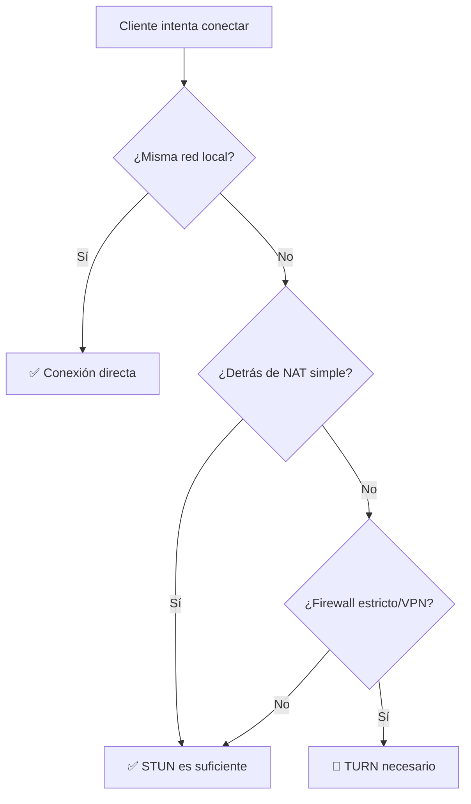

# Configuración STUN/TURN para Conectividad Global

## ❓ ¿Por qué necesitas STUN/TURN?

El servidor de señalización **solo intercambia mensajes** entre clientes para coordinar la conexión WebRTC. Pero para establecer la conexión **peer-to-peer real**, WebRTC necesita:

- **STUN servers**: Para descubrir tu IP pública cuando estás detrás de NAT
- **TURN servers**: Para retransmitir tráfico cuando la conexión directa P2P falla (firewalls estrictos, VPN, redes corporativas)

### 📊 Cuándo se necesita cada uno:



## 🌍 Servidores STUN Públicos Gratuitos

Estos servidores STUN son gratuitos y funcionan para la mayoría de casos:

```javascript
const iceServers = [
  { urls: 'stun:stun.l.google.com:19302' },
  { urls: 'stun:stun1.l.google.com:19302' },
  { urls: 'stun:stun2.l.google.com:19302' },
  { urls: 'stun:stun3.l.google.com:19302' },
  { urls: 'stun:stun4.l.google.com:19302' },
];
```

## 🔧 Configuración con y-webrtc

### Opción 1: Solo STUN (gratis, funciona en ~80% de casos)

```javascript
import * as Y from 'yjs';
import { WebrtcProvider } from 'y-webrtc';

const ydoc = new Y.Doc();

const provider = new WebrtcProvider(
  'my-room-name',
  ydoc,
  {
    signaling: ['wss://your-signaling-server.deno.dev'],
    password: 'your-secure-password',
    // Configuración ICE para NAT traversal
    peerOpts: {
      config: {
        iceServers: [
          { urls: 'stun:stun.l.google.com:19302' },
          { urls: 'stun:stun1.l.google.com:19302' },
        ]
      }
    }
  }
);
```

### Opción 2: STUN + TURN (más confiable, ~99% de casos)

Para casos difíciles (VPN, firewalls corporativos), necesitas un servidor TURN:

```javascript
const provider = new WebrtcProvider(
  'my-room-name',
  ydoc,
  {
    signaling: ['wss://your-signaling-server.deno.dev'],
    password: 'your-secure-password',
    peerOpts: {
      config: {
        iceServers: [
          // STUN servers (gratis)
          { urls: 'stun:stun.l.google.com:19302' },
          
          // TURN servers (requiere servicio pago o self-hosted)
          {
            urls: 'turn:your-turn-server.com:3478',
            username: 'your-username',
            credential: 'your-password'
          }
        ]
      }
    }
  }
);
```

## 🏗️ Opciones de Servidores TURN

### Servicios Comerciales (Fácil, pago)

1. **Twilio STUN/TURN**
   - [https://www.twilio.com/stun-turn](https://www.twilio.com/stun-turn)
   - Tier gratuito: 10GB/mes
   - Muy confiable

2. **Metered.ca**
   - [https://www.metered.ca/](https://www.metered.ca/)
   - Tier gratuito: 50GB/mes
   - Fácil de configurar

3. **Cloudflare Calls** (Beta)
   - [https://developers.cloudflare.com/calls/](https://developers.cloudflare.com/calls/)
   - Precios competitivos
   - Integración con Cloudflare

### Self-hosted (Gratis, requiere servidor)

Si tienes un VPS, puedes instalar **coturn**:

```bash
# Ubuntu/Debian
sudo apt-get install coturn

# Configuración básica en /etc/turnserver.conf
listening-port=3478
fingerprint
lt-cred-mech
user=username:password
realm=yourdomain.com
```

Ejemplo con coturn self-hosted:

```javascript
{
  urls: 'turn:your-vps-ip:3478',
  username: 'username',
  credential: 'password'
}
```

## 🧪 Configuración Completa de Ejemplo

```javascript
import * as Y from 'yjs';
import { WebrtcProvider } from 'y-webrtc';

const ydoc = new Y.Doc();

// Configuración robusta que funciona globalmente
const provider = new WebrtcProvider(
  'my-collaborative-doc',
  ydoc,
  {
    // Tu servidor de señalización
    signaling: ['wss://my-signaling-server.deno.dev'],
    password: 'my-secret-password',
    
    // Configuración WebRTC
    peerOpts: {
      config: {
        iceServers: [
          // Google STUN (gratis)
          { urls: 'stun:stun.l.google.com:19302' },
          { urls: 'stun:stun1.l.google.com:19302' },
          
          // Metered.ca TURN (ejemplo - regístrate para credenciales)
          {
            urls: 'turn:a.relay.metered.ca:80',
            username: 'your-metered-username',
            credential: 'your-metered-credential',
          },
          {
            urls: 'turn:a.relay.metered.ca:443',
            username: 'your-metered-username',
            credential: 'your-metered-credential',
          },
        ],
        
        // Configuraciones opcionales para mejorar conectividad
        iceTransportPolicy: 'all', // 'relay' para forzar TURN
        iceCandidatePoolSize: 10,
      }
    },
    
    // Configuraciones adicionales de y-webrtc
    maxConns: 20, // Máximo de conexiones P2P simultáneas
    filterBcConns: true, // Filtrar duplicados
  }
);

// Logs de debugging
provider.on('peers', event => {
  console.log('Peers conectados:', event);
});

provider.on('status', event => {
  console.log('Estado de conexión:', event.status);
});
```

## 🔍 Debugging de Problemas de Conexión

### Ver estadísticas de ICE en navegador:

```javascript
// Monitorear el estado de conexión
provider.on('synced', event => {
  console.log('✅ Sincronizado:', event.synced);
});

// Ver peers conectados
setInterval(() => {
  console.log('Peers actuales:', provider.room?.webrtcConns.size);
}, 5000);
```

### Verificar en Chrome DevTools:

1. Abre DevTools → **Network** → **WS** (WebSocket)
2. Verifica que la conexión al servidor de señalización funciona
3. Abre **chrome://webrtc-internals/** para ver detalles de ICE

### Prueba de conectividad:

```bash
# Prueba tu servidor TURN
npm install -g turnutils-tester

turntest -N -v \
  -u username \
  -p password \
  -r yourdomain.com \
  your-turn-server.com:3478
```

## 📋 Checklist de Troubleshooting

- [ ] ✅ El servidor de señalización está online (`/health` responde)
- [ ] ✅ La autenticación funciona (revisa logs del servidor)
- [ ] ✅ Los clientes se suscriben al mismo room
- [ ] ⚠️ Configuraste servidores STUN
- [ ] ⚠️ Si usas VPN/firewall estricto, necesitas TURN
- [ ] ⚠️ Las credenciales de TURN son correctas
- [ ] ⚠️ El servidor TURN permite el puerto correcto

## 🎯 Recomendaciones por Caso de Uso

### Desarrollo/Testing
```javascript
// Solo STUN es suficiente
iceServers: [
  { urls: 'stun:stun.l.google.com:19302' }
]
```

### Producción (Usuarios en misma región)
```javascript
// STUN + un servidor TURN de respaldo
iceServers: [
  { urls: 'stun:stun.l.google.com:19302' },
  { 
    urls: 'turn:your-turn.com:3478',
    username: 'user',
    credential: 'pass'
  }
]
```

### Producción (Usuarios globales + VPN)
```javascript
// Múltiples STUN + TURN redundante
iceServers: [
  { urls: 'stun:stun.l.google.com:19302' },
  { urls: 'stun:stun1.l.google.com:19302' },
  { 
    urls: 'turn:turn1.yourservice.com:443',
    username: 'user',
    credential: 'pass'
  },
  { 
    urls: 'turn:turn2.yourservice.com:443',
    username: 'user',
    credential: 'pass'
  }
]
```

## 💡 Solución Rápida (Metered.ca - Gratis)

1. **Regístrate** en [metered.ca](https://www.metered.ca/tools/openrelay/)
2. **Copia las credenciales** que te dan
3. **Úsalas inmediatamente**:

```javascript
const provider = new WebrtcProvider('my-room', ydoc, {
  signaling: ['wss://your-signaling-server.deno.dev'],
  password: 'your-password',
  peerOpts: {
    config: {
      iceServers: [
        { urls: 'stun:stun.l.google.com:19302' },
        {
          urls: 'turn:a.relay.metered.ca:80',
          username: 'TU-USERNAME-AQUI',
          credential: 'TU-CREDENTIAL-AQUI',
        },
      ]
    }
  }
});
```

## 🔗 Recursos Adicionales

- [MDN: WebRTC Protocols](https://developer.mozilla.org/en-US/docs/Web/API/WebRTC_API/Protocols)
- [STUN/TURN explained](https://www.html5rocks.com/en/tutorials/webrtc/infrastructure/)
- [coturn GitHub](https://github.com/coturn/coturn)
- [Metered.ca Free TURN](https://www.metered.ca/tools/openrelay/)
